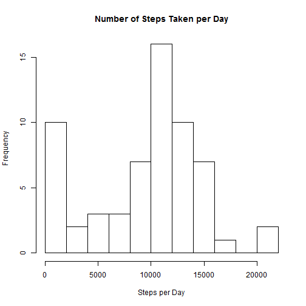
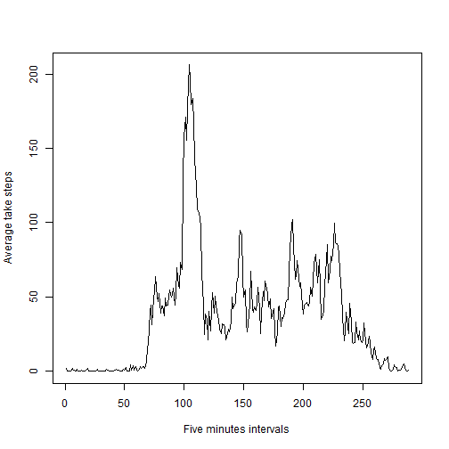
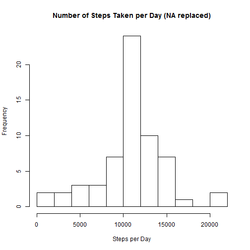

# Reproducible Research: Peer Assessment 1
========================================================
## Loading and preprocessing the data

1 Load the data (i.e. read.csv())

2 Process/transform the data (if necessary) into a format        suitable for your analysis


```r
file <- "activity.csv"
originalData <- read.csv("activity.csv", header = TRUE, colClasses = c("numeric", 
    "Date", "numeric"), stringsAsFactors = FALSE)
```


## What is mean total number of steps taken per day?

1 Make a histogram of the total number of steps taken each day

2 Calculate and report the mean and median total number of steps taken per day


```r
require(plyr)
```

```
## Loading required package: plyr
```

```
## Warning: package 'plyr' was built under R version 3.0.3
```

```r
subsetdata1 <- ddply(originalData, .(date), summarize, steps = sum(steps, na.rm = TRUE))
hist(subsetdata1$steps, breaks = 15, main = "Number of Steps Taken per Day", 
    xlab = "Steps per Day", ylab = "Frequency")
```

 

```r
meanVal <- mean(subsetdata1$steps)
medVal <- median(subsetdata1$steps)
cat("Mean value of steps taken per day is: ", meanVal, "\nMedian value of steps taken per day is: ", 
    medVal)
```

```
## Mean value of steps taken per day is:  9354 
## Median value of steps taken per day is:  10395
```


## What is the average daily activity pattern?

1 Make a time series plot (i.e. type = "l") of the 5-minute interval (x-axis) and the average number of steps taken, averaged across all days (y-axis)

2 Which 5-minute interval, on average across all the days in the dataset, contains the maximum number of steps?


```r
subsetdata2 <- ddply(originalData, .(interval), summarize, average_steps = mean(steps, 
    na.rm = TRUE))
plot(1:nrow(subsetdata2), subsetdata2$average_steps, type = "l", xlab = "Five minutes intervals", 
    ylab = "Average take steps")
```

 

```r
maxInterval <- subsetdata2[which.max(subsetdata2[, "average_steps"]), ]
cat("The Interval ", maxInterval$interval, " On average accross all days has the maximum number of steps which is equal to", 
    maxInterval$average_steps)
```

```
## The Interval  835  On average accross all days has the maximum number of steps which is equal to 206.2
```


## Imputing missing values

1 Calculate and report the total number of missing values in the dataset (i.e. the total number of rows with NAs)

2 Devise a strategy for filling in all of the missing values in the dataset. The strategy does not need to be sophisticated. For example, you could use the mean/median for that day, or the mean for that 5-minute interval, etc.

3 Create a new dataset that is equal to the original dataset but with the missing data filled in.

4 Make a histogram of the total number of steps taken each day and Calculate and report the mean and median total number of steps taken per day. Do these values differ from the estimates from the first part of the assignment? What is the impact of imputing missing data on the estimates of the total daily number of steps?


```r
Missingrows <- nrow(originalData[!complete.cases(originalData), ])
cat("Total Number of Rows with NA's is ", Missingrows)
```

```
## Total Number of Rows with NA's is  2304
```

```r
filleddata = originalData
filleddata[is.na(filleddata)] = subsetdata2$average_steps
## FillIn function is another method for filling in missing values
## require(DataCombine) filledDataSet <- FillIn(originalData, subsetdata2,
## 'steps', 'average_steps', 'interval')
subsetdata3 <- ddply(filleddata, .(date), summarize, steps = sum(steps))
hist(subsetdata3$steps, breaks = 15, main = "Number of Steps Taken per Day (NA replaced)", 
    xlab = "Steps per Day", ylab = "Frequency")
```

 

```r
meanVal2 <- mean(filleddata$steps)
medVal2 <- median(filleddata$steps)
cat("Mean value of steps taken per day is (with NA's replaced): ", meanVal2, 
    "\nMedian value of steps taken per day is: ", medVal2)
```

```
## Mean value of steps taken per day is (with NA's replaced):  37.38 
## Median value of steps taken per day is:  0
```

The results shows that imputing missing data will change the average number of steps taken as well as the median value. The average number of steps taken per day is significantly reduced

## Are there differences in activity patterns between weekdays and weekends?

1 Create a new factor variable in the dataset with two levels - "weekday" and "weekend" indicating whether a given date is a weekday or weekend day.

2 Make a panel plot containing a time series plot (i.e. type = "l") of the 5-minute interval (x-axis) and the average number of steps taken, averaged across all weekday days or weekend days (y-axis).


```r
filleddata$weekDays <- weekdays(filleddata$date)
# create a logical vector that includes only weekend
l <- filleddata$weekDays == "Saturday" | filleddata$weekDays == "Sunday"
filleddata$weekDays[l] <- "weekend"
filleddata$weekDays[!l] <- "weekday"
filleddata$weekDays <- as.factor(filleddata$weekDays)
total_average = ddply(filleddata, .(interval, weekDays), summarise, steps = mean(steps))
require(lattice)
```

```
## Loading required package: lattice
```

```
## Warning: package 'lattice' was built under R version 3.0.3
```

```r
xyplot(steps ~ interval | weekDays, data = total_average, layout = c(1, 2), 
    type = "l", ylab = "Number of steps")
```

 

